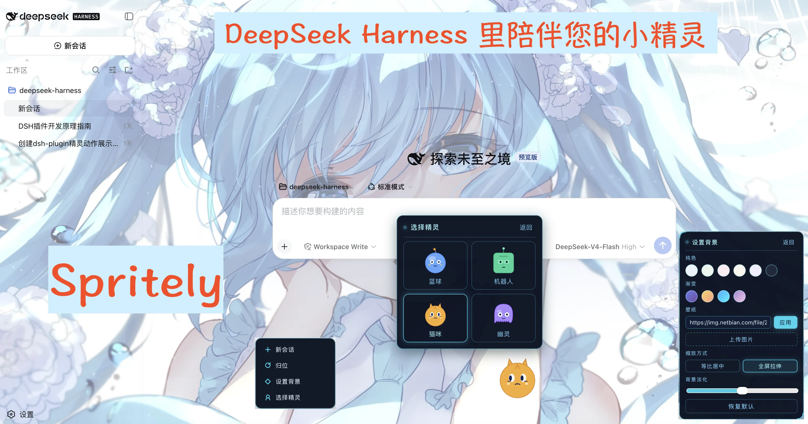
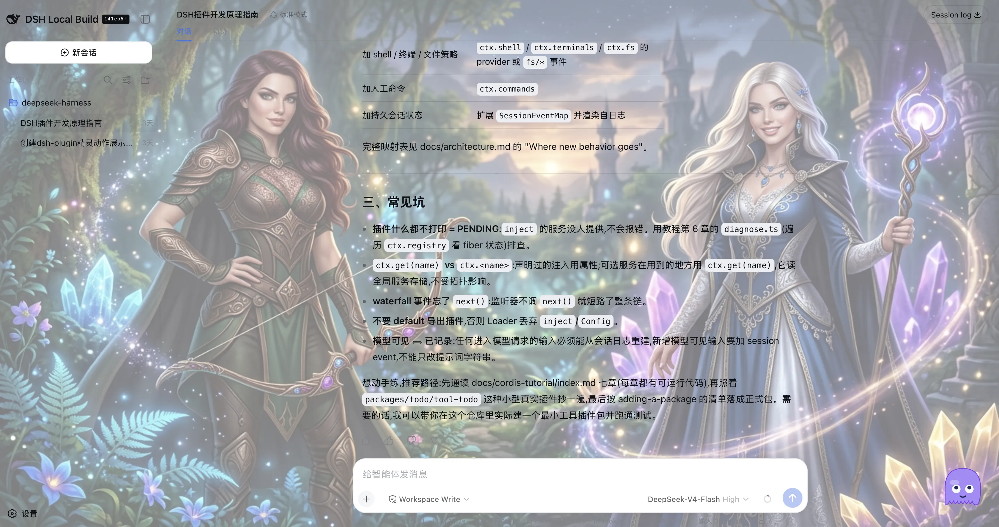
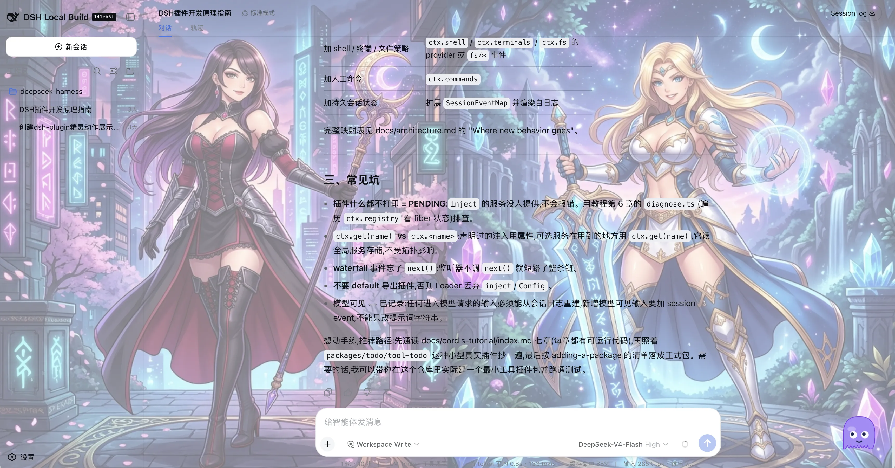
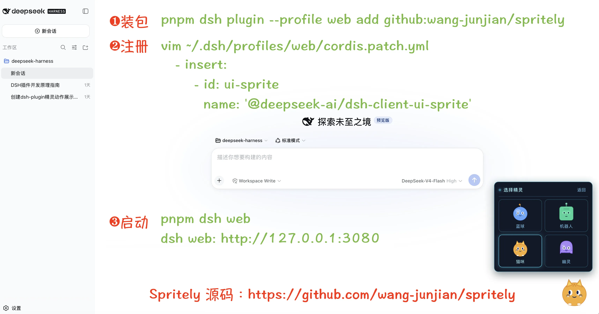

# Spritely

English | [Chinese](README.md)

> *Your spritely work companion* — a floating mascot for the dsh web UI that reacts to the agent's live work state.

Spritely (formerly the `ui-sprite` plugin) is a dsh client plugin that drops a small, animated character into the corner of the web interface. It watches the agent's activity — idle, thinking, writing, running tools, waiting on you, erroring, or finishing a run — and plays a matching pose, tracks your cursor with its eyes, and can be dragged anywhere.

<p align="center"><em>Four characters: Blob · Bot · Cat · Ghost</em></p>



## Features

- **Four switchable characters** — Blob (blue ball), Bot (mint robot), Cat (amber kitty), Ghost (violet specter), each with its own body and eye style.
- **Live work-state poses** — idle, thinking, writing, working, waiting, error, and a brief celebration when a run settles.
- **Cursor-tracking eyes** — pupils follow the mouse (rAF-throttled).
- **Draggable** — grab and move the mascot anywhere; reset returns it to the corner.
- **Customizable background** — solid colors, gradients, image URLs, and local image upload, with fit (contain / stretch) and a fade veil for legibility.
- **Sci-fi HUD styling** — the menu and panels use a fixed dark holographic palette with a cyan neon frame.
- **Persisted** — your character, background, and position survive reloads.





## Install

Spritely is a **dsh client plugin** (`dsh.client`, not a `dsh.bundle`). It ships prebuilt artifacts (`lib/`), so it installs from git or a local checkout without any build step. Activating it in a dsh profile takes two steps:

**1. Install the package into the profile.**

```bash
# from git
dsh plugin --profile <name> add github:wang-junjian/spritely

# or from a local checkout
dsh plugin --profile <name> add ./spritely
```

**2. Register a row in the browser plugin roster.** Because Spritely declares `dsh.client` rather than `dsh.bundle`, `dsh plugin add` installs it as a plain dependency (printing "activates no layer") and does **not** register a row for you. Add this row to your profile's patch layer at `~/.dsh/profiles/<name>/cordis.patch.yml`:

```yaml
- insert:
    - id: ui-sprite
      name: '@deepseek-ai/dsh-client-ui-sprite'
```

The plugin carries its own `dsh.client` metadata (`platform: web` plus its `inject` edges), so once the row is present the host Loader scans it, serves `/plugins/ui-sprite/client.js`, and injects it into `window.__DSH_BOOT__` automatically.

> Its peer dependencies (`@deepseek-ai/dsh-client-runtime`, `dsh-client-ui-layout`, `dsh-client-locale`, …) are in-box dsh packages resolved from the dsh installation itself — they need not be installed separately.



## Usage

Click the mascot to open its menu:

- **New session** — start a new session (default workspace flow).
- **Reset position** — return the mascot to its default corner.
- **Set background** — open the background console (colors, gradients, image URL, local upload, scale, fade).
- **Switch sprite** — pick one of the four characters.

## Characters

| Character | Look | Palette |
|---|---|---|
| Blob | round ball + antenna star | blue |
| Bot | rounded head + LED eyes | mint green |
| Cat | triangular ears + vertical pupils + whiskers | amber |
| Ghost | wavy hem + big round eyes | violet |

## Development

```bash
npm install          # installs dsh peer dependencies + dev tooling
npm run build        # tsc (types) + tsdown (node-half lib + browser client bundle)
npm test             # vitest
npm run watch        # tsdown --watch
```

The build emits the node-half library (`lib/index.js`, `lib/invariant.js`) and the browser client bundle (`lib/client.js`) in dsh's `__ModuleLoader__` closure-factory format, with CSS Modules inlined by lightningcss.

## License

[MIT](./LICENSE)
